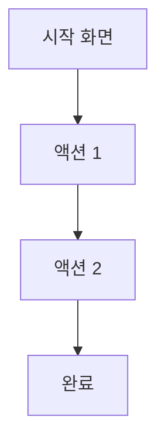

# [기능명] 기능 명세서

**작성일**: YYYY-MM-DD
**작성자**: PM
**상태**: 🚧 초안 / ✅ 승인됨 / ⏳ 검토 중
**버전**: 1.0
**대상 팀**: Backend / Mobile / Both

---

## 📋 개요

### 기능 설명
[이 기능이 무엇을 하는지 간단히 설명]

### 비즈니스 목표
- 목표 1: [왜 이 기능이 필요한가?]
- 목표 2: [사용자에게 어떤 가치를 제공하는가?]

### 우선순위
- [ ] 🔴 Critical (즉시 필요)
- [ ] 🟡 High (MVP 필수)
- [ ] 🟢 Medium (추후 가능)
- [ ] ⚪ Low (Nice to have)

---

## 👥 사용자 스토리

```
As a [사용자 유형],
I want to [기능],
So that [목적/이점].
```

**예시**:
```
As a 티켓 구매자,
I want to QR 코드를 스캔하여 티켓을 검증할 수 있다,
So that 가짜 티켓을 사지 않고 안전하게 거래할 수 있다.
```

---

## 🎯 수용 기준 (Acceptance Criteria)

기능이 완료되었다고 판단할 수 있는 기준:

- [ ] 기준 1: [구체적이고 측정 가능한 기준]
- [ ] 기준 2: [예: 사용자가 QR 코드를 스캔하면 5초 이내에 검증 결과가 표시된다]
- [ ] 기준 3: [예: 잘못된 QR 코드 입력 시 에러 메시지가 표시된다]
- [ ] 기준 4: [예: 검증 결과가 데이터베이스에 저장된다]

---

## 🔧 기술 요구사항

### Backend 요구사항
- [ ] API 엔드포인트: `[METHOD] /api/[path]`
- [ ] 데이터베이스 변경: [테이블 추가/수정 여부]
- [ ] 외부 API 연동: [필요 시 명시]
- [ ] 인증/인가: [필요 여부]

### Mobile 요구사항
- [ ] 새 화면 추가: [화면명]
- [ ] 기존 화면 수정: [화면명]
- [ ] 상태 관리: [Riverpod Provider 타입]
- [ ] 외부 패키지: [필요 시 명시]

---

## 📐 상세 설계

### 화면 플로우


### 데이터 모델
```dart
// Mobile (Entity)
class FeatureEntity {
  final int id;
  final String name;
  // ...
}
```

```csharp
// Backend (DTO)
public class FeatureDto
{
    public int Id { get; set; }
    public string Name { get; set; }
    // ...
}
```

### API 명세
- **요청 예시**: [관련 API 명세 문서 링크]
- **응답 예시**: [관련 API 명세 문서 링크]

---

## 🚨 예외 처리

### 에러 케이스
1. **케이스 1**: [예: 네트워크 오류]
   - 에러 메시지: "네트워크 연결을 확인해주세요"
   - 처리 방법: 재시도 버튼 표시

2. **케이스 2**: [예: 권한 없음]
   - 에러 메시지: "권한이 없습니다"
   - 처리 방법: 로그인 화면으로 이동

---

## 📱 UI/UX 스펙 (모바일)

### 화면 레이아웃
```
┌─────────────────────┐
│  AppBar (타이틀)    │
├─────────────────────┤
│                     │
│  메인 컨텐츠        │
│                     │
├─────────────────────┤
│  액션 버튼          │
└─────────────────────┘
```

### 위젯 구조
```
FeatureView
├── FeatureAppBar
├── FeatureBody
│   ├── FeatureHeader
│   ├── FeatureContent
│   └── FeatureFooter
└── FeatureBottomAction
```

### 디자인 가이드
- 색상: `AppColors.[색상명]`
- 폰트: `AppTextStyles.[스타일명]`
- 간격: `AppSpacing.[크기]`

---

## 🗄️ 데이터베이스 변경 (백엔드)

### 테이블 생성/수정
```sql
-- 테이블 생성
CREATE TABLE feature_table (
    id BIGINT PRIMARY KEY AUTO_INCREMENT,
    name VARCHAR(255) NOT NULL,
    created_at DATETIME NOT NULL,
    INDEX idx_name (name)
);
```

### 마이그레이션 필요 여부
- [ ] Yes (스크립트 별도 작성)
- [ ] No

---

## 🧪 테스트 계획

### Backend 테스트
- [ ] 단위 테스트: [Service, Repository]
- [ ] 통합 테스트: [API 엔드포인트]
- [ ] 부하 테스트: [필요 시]

### Mobile 테스트
- [ ] 위젯 테스트: [주요 위젯]
- [ ] 통합 테스트: [화면 플로우]
- [ ] E2E 테스트: [전체 시나리오]

### 수동 테스트 시나리오
1. 시나리오 1: [사용자가 ~ 을 했을 때 ~ 가 표시된다]
2. 시나리오 2: [...]

---

## 📅 일정

### 예상 개발 기간
- Backend: [X일]
- Mobile: [X일]
- **총 예상 기간**: [X일]

### 마일스톤
- [ ] 설계 완료: [날짜]
- [ ] 개발 완료: [날짜]
- [ ] 테스트 완료: [날짜]
- [ ] 배포: [날짜]

---

## 📦 의존성

### 선행 작업
- [필요한 다른 작업이나 기능]
- 관련 이슈: #123

### 후속 작업
- [이 기능 완료 후 진행할 작업]
- 관련 이슈: #456

---

## 📌 추가 고려사항

### 성능
- [성능 목표: 예: 응답 시간 < 500ms]

### 보안
- [보안 고려사항: 예: 인증 토큰 필요]

### 확장성
- [향후 확장 가능성]

---

## 📚 참고 자료

- 관련 문서: [링크]
- 디자인 목업: [링크]
- 외부 API 문서: [링크]

---

## 💬 리뷰 코멘트

| 날짜 | 리뷰어 | 코멘트 | 상태 |
|------|--------|--------|------|
| YYYY-MM-DD | [이름] | [코멘트] | ✅ 반영 / ⏳ 대기 |

---

**최종 승인**: [ ] PM / [ ] Backend Lead / [ ] Mobile Lead
**승인 날짜**: YYYY-MM-DD
